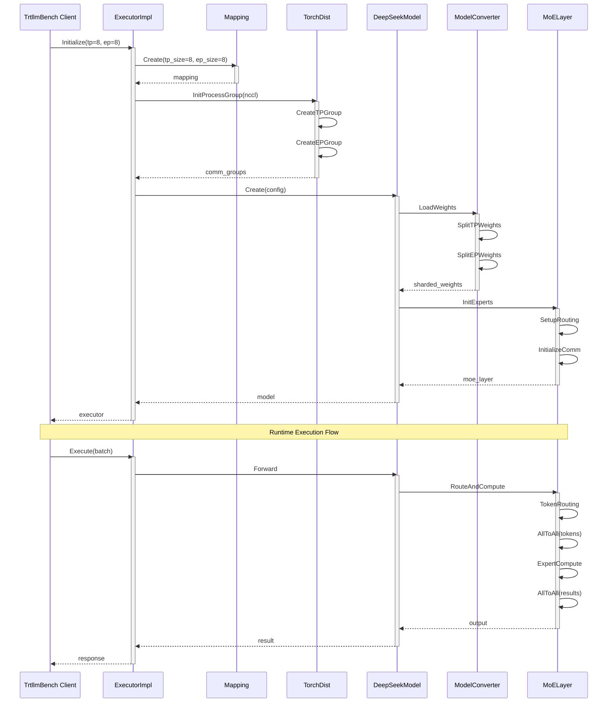

# How Hybrid TP with EP implemented in TensorRT-LLM

# Workflow

```mermaid
sequenceDiagram
    participant Client as TrtllmBench Client
    participant Executor as ExecutorImpl
    participant Mapping as Mapping
    participant Comm as TorchDist
    participant Model as DeepSeekModel
    participant Convert as ModelConverter
    participant MoE as MoELayer

    Client->>Executor: Initialize(tp=8, ep=8)
    activate Executor
    
    Executor->>Mapping: Create(tp_size=8, ep_size=8)
    activate Mapping
    Mapping-->>Executor: mapping
    deactivate Mapping
    
    Executor->>Comm: InitProcessGroup(nccl)
    activate Comm
    Comm->>Comm: CreateTPGroup
    Comm->>Comm: CreateEPGroup
    Comm-->>Executor: comm_groups
    deactivate Comm
    
    Executor->>Model: Create(config)
    activate Model
    
    Model->>Convert: LoadWeights
    activate Convert
    Convert->>Convert: SplitTPWeights
    Convert->>Convert: SplitEPWeights
    Convert-->>Model: sharded_weights
    deactivate Convert
    
    Model->>MoE: InitExperts
    activate MoE
    MoE->>MoE: SetupRouting
    MoE->>MoE: InitializeComm
    MoE-->>Model: moe_layer
    deactivate MoE
    
    Model-->>Executor: model
    deactivate Model
    
    Executor-->>Client: executor
    deactivate Executor
    
    Note over Client,MoE: Runtime Execution Flow
    
    Client->>Executor: Execute(batch)
    activate Executor
    
    Executor->>Model: Forward
    activate Model
    
    Model->>MoE: RouteAndCompute
    activate MoE
    MoE->>MoE: TokenRouting
    MoE->>MoE: AllToAll(tokens)
    MoE->>MoE: ExpertCompute
    MoE->>MoE: AllToAll(results)
    MoE-->>Model: output
    deactivate MoE
    
    Model-->>Executor: result
    deactivate Model
    
    Executor-->>Client: response
    deactivate Executor
```